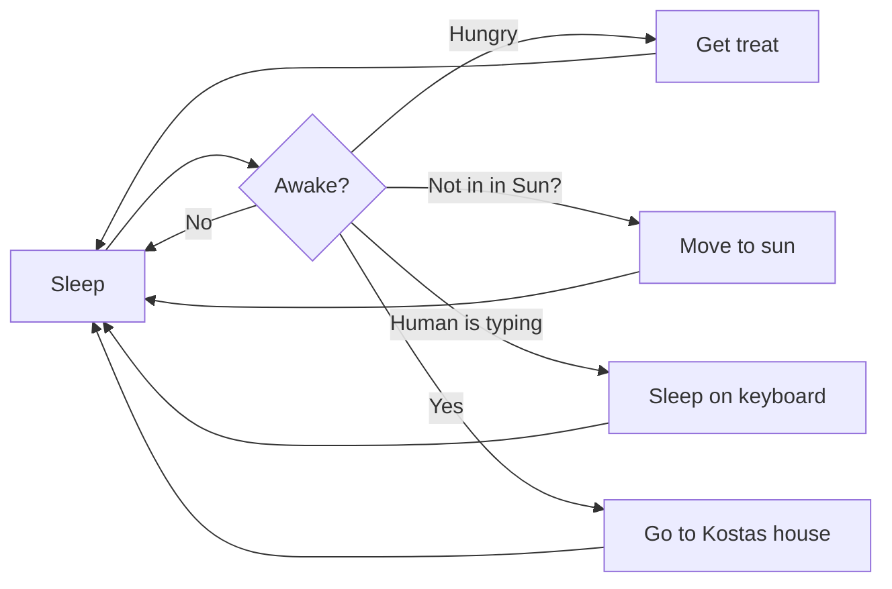

Hi to whoever is reading this! Here you will find the report and the code for our assignment. The report is in the doc folder.

Before you run our code, you must install the NiceGUI, OpenCV, NumPy and Requests libraries using pip. If you are on Linux, open a terminal on this directory and run the command below:
```bash
chmod +x src/init.sh
./src/init.sh
```
Then, navigate to src and run the gui.py script. Once the server starts, open localhost on port 8080 by ctrl+clicking the link from the terminal. Use the burger menu to select an algorithm, add start, goal and obstacles and click "find path" to generate the command file for the drone. Go to the dashboard and click start mission to start the mission. Use the updater.py to update the UI. That's all!

P.S. Our code contains easter-eggs, just like the one below ;-)

Open this file in VS Code, right click the tab and click 'Open Preview' to view to correctly.


